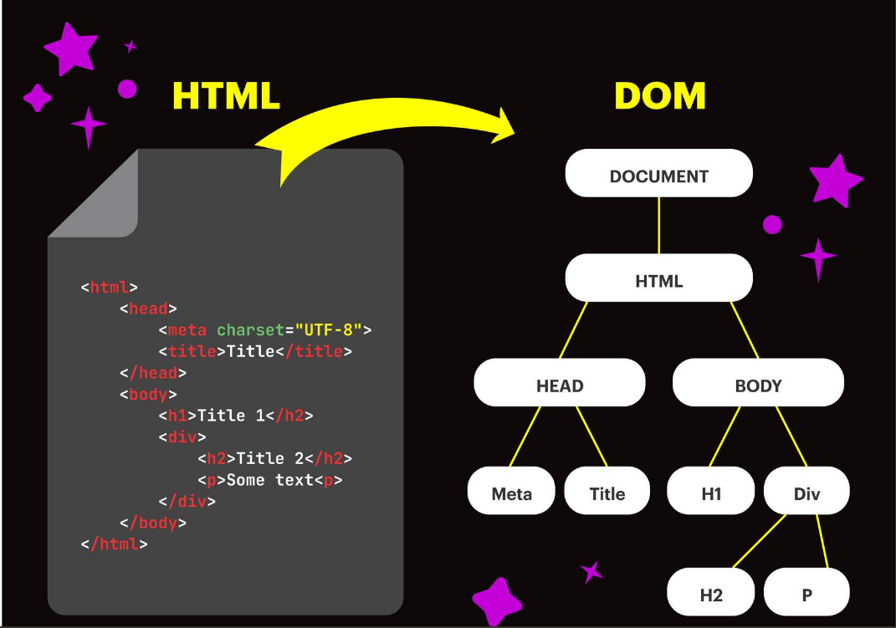

# Parseado
 "Parsear un documento" se refiere al proceso que realiza un navegador web para interpretar y convertir el código en una estructura de datos que pueda ser entendida y manipulada por el navegador para su visualización.

### Análisis léxico
 El código fuente del documento se divide en **tokens** (como etiquetas, atributos, texto, etc.). Esta fase identifica las partes individuales del código.

### Análisis sintáctico (Parsing):
 Los tokens se organizan en una estructura jerárquica que sigue las reglas gramaticales del lenguaje (como las reglas de etiquetado y anidamiento en HTML). Se verifica si la estructura del documento cumple con la sintaxis esperada.

### Construcción del árbol DOM (Document Object Model):
 Basado en la estructura jerárquica creada en el paso anterior, se construye el `árbol DOM`, que es una representación estructurada de todos los elementos del documento y su relación entre sí.




### Renderización:
 Una vez que se ha construido el árbol DOM, el navegador utiliza esta estructura para renderizar el contenido en la ventana del navegador. Esto consiste en el proceso para visualización de texto, imágenes, estilos, etc.

#### Al Parsear
 Al `parsear` se puede recorrer el registro de una base de datos, pudiendo seleccionar, agregar, eliminar o editar registros.

## Selectors
 Cuando el Browser parsea el documento HTML, crea una estructura de árbol (`el DOM`). Hay que pensar que el `DOM` es un modelo de la página en forma de objetos. `JavaScript` no sabe cómo trabajar con `HTML`, pero sí con `objetos`. Por lo tanto, cada elemento HTML que esté en el DOM, podremos usarlo como un `objeto`, que tendrá sus `propiedades y métodos`. Dentro de todos los `métodos` que contiene `document en su prototipo los mas útiles son los selectores`. Los `selectores nos permitirán buscar y recuperar un elemento del DOM`, sólo que ahora el elemento retornado es un `objeto JS` que representa una `entidad HTML`.

# Los principales 5 selectores son los siguientes:

## getElementsByClassName
 document.getElementsByClassName se encarga de encontrar elementos en función del nombre de su clase. Devuelve un objeto similar a un array, conteniendo los objetos que coincidieron con la búsqueda que puede ser iterado. Debemos brindarle como parámetro un string con el nombre de la clase que deseamos buscar. 

##### Ejemplo divClass

```JavaScript
const divs = document.getElementsByClassName('divClass');
```

## getElementById
 document.getElementById se encarga de encontrar un único elemento en función de su ID, por lo que devolverá dicho elemento. Debemos brindarle como parámetro un string con el ID del elemento que deseamos buscar. 

##### Ejemplo ID 'divId'

```JavaScript
const divs = document.getElementsById('divId');
```

## querySelector
 document.querySelector es un método que busca los elementos basándose en uno o más selectores CSS. Recordemos que es posible hacer referencia a clases utilizando un ., a ids con # y a elementos usando el nombre de su etiqueta directamente. Es recomendable utilizar sólo ids con querySelector ya que sólo retornará el primer elemento que coincida con el selector indicado. 

##### Ejemplo primer elemento clase 'divId'
    Si hay más elementos con dicha clase no los tendrá en cuenta.

```JavaScript
const div = document.querySelector('.divId');
```

## querySelectorAll
 document.querySelectorAll funciona de la misma forma que querySelector pero en vez de devolver únicamente el primer elemento que coincida con el selector devolverá un objeto similar a un array.

##### Ejemplo array elementos que contengan la clase 'divId'

```JavaScript
const divs = document.querySelectorAll('.divId');
```
## createElement
 En el caso de que queramos crear un elemento para agregarlo al DOM podemos utilizar document.createElement. Este método recibe como parámetro un string indicando el tipo de elemento que deseamos crear y devuelve un elemento vacío de dicho tipo. 

##### Ejemplo estamos creando un nuevo elemento 'div' vacío.

```JavaScript
const Newdiv = document.createElement('div');
```


# métodos más comunes

## .innerHTML
 Cuando seleccionas un elemento podemos utilizar distintos métodos y propiedades para modificarlo, por ejemplo, cambiar su estilo, cambiar de atributos, agregar/eliminar elementos anidados, agregar/eliminar event listeners.

```JavaScript
const p = document.querySelector('#pId');
console.log(p.innerHtml) // Va a imprimir el texto dentro del párrafo con el id 'pID'
p.innerHTML = 'Nuevo texto'; // Acá estamos modificando el texto del párrafo mencionado anteriormente
console.log(p.innerHTML); // Va a imprimir el nuevo texto que le seteamos, es decir: "Nuevo texto"
```

## .[attribute] y .setAttribute
 Podemos llamar al método .setAttribute para agregar un atributo a un elemento o sobreescribirlo en el caso de que ya se encuentre definido. Otra forma equivalente de realizarlo pero más corta sería llamando a .[nombre del atributo] = [nuevo valor]. 

```JavaScript
const a = document.querySelector('#linkHenry'); // Obtengo el elemento a cuyo id es 'linkHenry'
a.setAttribute('href', 'https://www.soyhenry.com/'); // Seteo el atributo href del elemento a para que redireccione a la página principal de Henry
a.href = 'https://www.soyhenry.com/'; // Equivalente al anterior pero más corto
```

## .style
 Podemos modificar el estilo de un elemento utilizando .style. Cabe mencionar que con esto no estamos accediendo al estilo CSS sino que lo que estamos haciendo es agregar la propiedad style dentro de la etiqueta HTML.

 ```JavaScript
 const div = document.querySelector('#divId');
div.style.height = '300px'; // Le damos una altura de 300 pixeles al div cuyo id es 'divId'
div.style.background = 'red'; // Le seteamos el color de fondo en rojo a dicho div
 ```

## .className y .id
 Podemos utilizar .className y .id para acceder y modificar las clases o ids de los elementos. Esto es útil cuando ya tenemos definido en los estilos CSS un estilo en particular asociado a una clase o id y queremos simplemente modificando la clase o id del elemento cambiar su estilo sin tener que modificar propiedad por propiedad.

 ```JavaScript
const div = document.querySelector('#divId');
console.log(div.id); // Utilizando ',id' accedemos al nombre de su id, en este caso 'divId'
div.className = 'nuevaClase'; // Le seteamos la clase 'nuevaClase'
div.id = 'nuevoId'; // Le seteamos el id 'nuevoId'
 ```

## .appendChild
 Es posible agregar elementos directamente al DOM utilizando .appendChild sobre el elemento que queremos que sea su padre.

```JavaScript
const body = document.querySelector('body');
const newDiv = document.createElement('div'); // Creamos un nuevo elemento div
body.appendChild(newDiv); // Agregamos el div recién creado dentro del body de la paǵina
```

# Event Listener
 Un Event Listener es una función que se ejecuta luego de que ocurra un determinado evento. Existen diferentes tipos de eventos, entre ellos se encuentran: un clic, un desplazamiento del mouse por encima del elemento, el pulsado de una tecla, etc.

## Click .onclic 🖱️
 El evento más común es el de clic y, en particular, es el único que posee la propiedad **.onclick** para asignarle una función que será ejecutada al clickear el componente indicado. 
 En este ejemplo lo que estamos haciendo es indicarle que cuando se clickee el div cuyo id es 'divId' se ejecute la función ahí definida que lo único que hará en este caso es escribir por consola "clickeado"

```JavaScript
const div = document.querySelector('#divId');
div.onclic = function() {console.log('clickeado')};
```

## .addEventListener y otros eventos
 **.addEventListener** es un método que recibe como primer parámetro el `tipo de evento` que va a estar esperando y como segundo parámetro una función callback que es la que va a ejecutarse cuando ocurra dicho evento. 
 En este ejemplo lo que estamos haciendo es indicarle que cuando el mouse ingrese al div cuyo id es 'divId' se ejecute la función ahí definida que lo único que hará en este caso es escribir por consola "¡El mouse entró!"

```JavaScript
const div = document.querySelector('#divId');
div.addEventListener('mouseenter', function() {console.log('El mouse entró!')})
```

###### Nota: es mejor utilizar addEventListener en todos los casos incluyendo los clics. 

